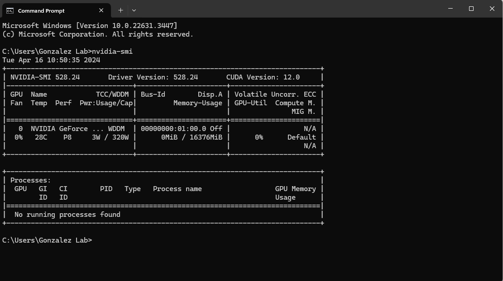
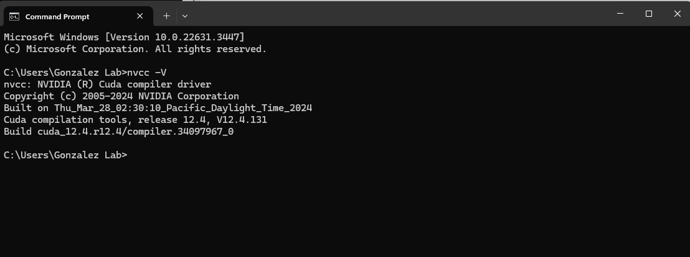
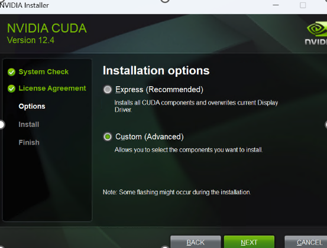
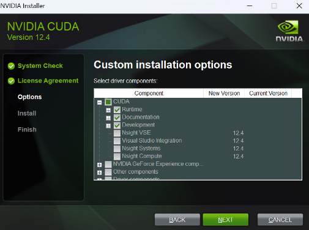
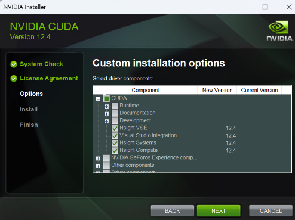
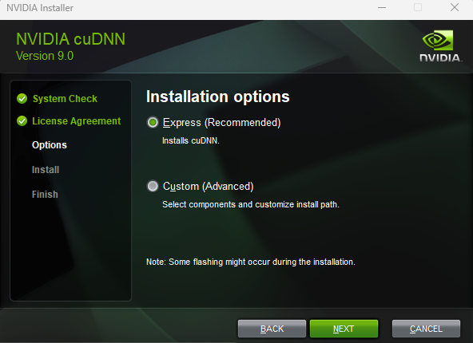
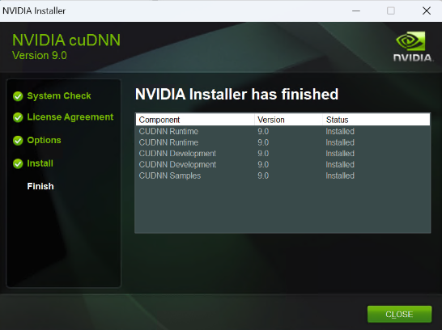
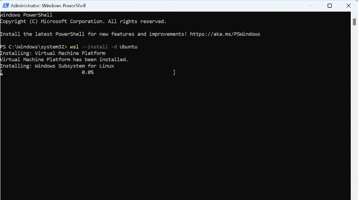
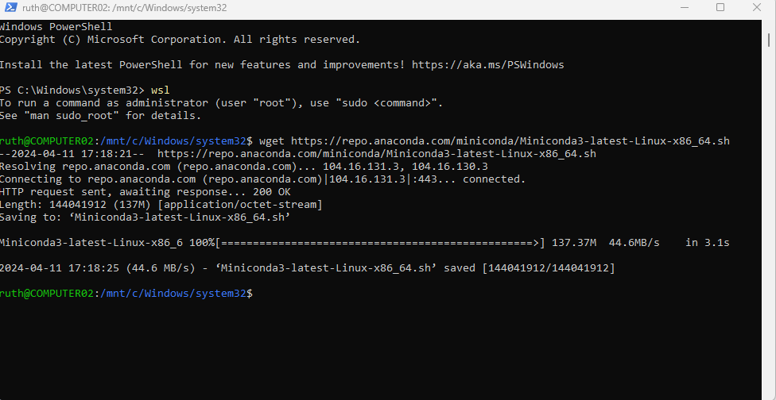
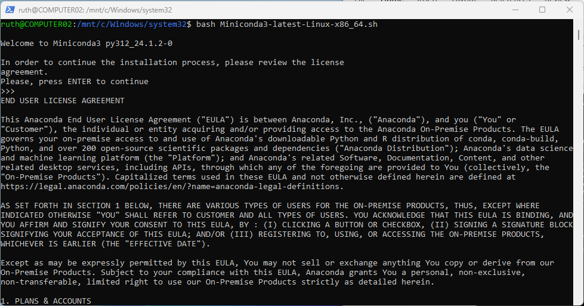

# **Windows Subsystem for Linux (WSL)**

WSL lets linux system to run in windows machine. For this tutorial we will focus on Ubuntu linux distribution.
To learn more about WSL please visit- https://learn.microsoft.com/en-us/windows/wsl/about

First let's start by installing Nvidia Drivers, Cuda toolkit and CUDNN in windows before procedding to WSL Ubuntu.


## Download Visual Studio

https://visualstudio.microsoft.com/downloads/

## Download CUDA toolkit

Download the latest CUDA toolkit that's compatable to your device.

[Download CUDA here](https://developer.nvidia.com/cuda-downloads?target_os=Windows&target_arch=x86_64&target_version=11&target_type=exe_network)

## Check the CUDA verison
  
To check NVIDIA Drivers are properly installed
* Open Command Line Windows(CMD) and type

```
nvdia-smi
```

* Open Command Line Windows(CMD) and type
  


To check NVIDIA CUDA compiler (cudnn)

```
nvcc -V
```


## Run CUDA Toolkit network installer

Make sure to select custom only CUDA runtime option



From the top options - select cuda expand the selection item.

Continue to select Runtime, Documentation and Development from the submenu



Also select Nsight VSE, Visual Studio Integration,Nsight Systmens and Nsight Compute from the submenus as shown below.



## Download cuDNN

https://developer.nvidia.com/cudnn

Once done with the download install cuDNN in Express (Recommended) mode.

.

After all the installations are finished, you can see the cudNN library version and status for each installs.

.

## Install Ubuntu in WSL2

Open Windows Power shell. Type the following command to install Ubuntu distribution.

```
wsl --install -d Ubuntu
```

.

When the installation is finished, reboot your computer and open wsl. At this stage, you will need to provide a user name and a password. Once the operation is completed you will see a welcome message as shown below.


## Install Miniconda

Download miniconda using ``` wget``` command

```
wget https://repo.anaconda.com/miniconda/Miniconda3-latest-Linux-x86_64.sh

```
.

## Run miniconda installation

use ```bash``` command to run the miniconda installer

```
bash Miniconda3-latest-Linux-x86_64.sh
```
.

Press enter until the end of the use agreement to install miniconda. Once the installation is completed restart wsl.
## Upgrade and Update packages

```
sudo apt update && sudo apt upgrade
```

## Update Ubuntu Device

```
sudo apt install ubuntu-drivers-common
```

## Install CUDA Toolkit
```
sudo apt install nvidia-cuda-toolkit
```

## Verify CUDA installation

```nvcc –V ```

Now you can install different python libraries using ```conda```or ```pip```


---


Possible issues you may come across during installation

* Activating base envirnoment
```
source /home/"your username”/miniconda3/etc/profile.d/conda.sh
Conda activate “your virtual environment name”
```
In this case you might want to activate the ```base``` virtual envirnoment - please refer https://stackoverflow.com/a/64815977 


